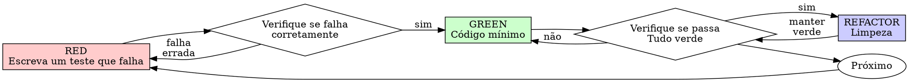

# Desenvolvimento Orientado a Testes (Test-Driven Development - TDD)

## Visão Geral (Overview)

Escreva o teste primeiro. Veja-o falhar. Escreva o código mínimo para fazê-lo passar.

**Princípio central:** Se você não viu o teste falhar, você não sabe se ele testa a coisa certa.

**Violar a letra das regras é violar o espírito das regras.**

## Quando Usar (When to Use)

**Sempre:**
- Novas funcionalidades (features)
- Correções de bugs (bug fixes)
- Refatoração (refactoring)
- Alterações de comportamento

**Exceções (pergunte ao seu parceiro humano):**
- Protótipos descartáveis (throwaway)
- Código gerado automaticamente
- Arquivos de configuração

Pensando em "pular o TDD só desta vez"? Pare. Isso é racionalização.

## A Regra de Ouro (The Iron Law)

```
NENHUM CÓDIGO DE PRODUÇÃO SEM UM TESTE FALHANDO PRIMEIRO
```

Escreveu o código antes do teste? Delete-o. Comece de novo.

**Sem exceções:**
- Não guarde como "referência"
- Não "adapte-o" enquanto escreve testes
- Não olhe para ele
- Deletar significa deletar

Implemente a partir do zero orientado pelos testes. Ponto final.

## Red-Green-Refactor



### RED - Escreva um Teste que Falha

Escreva um teste mínimo mostrando o que deve acontecer.

<Good>
```typescript
test('retries failed operations 3 times', async () => {
  let attempts = 0;
  const operation = () => {
    attempts++;
    if (attempts < 3) throw new Error('fail');
    return 'success';
  };

  const result = await retryOperation(operation);

  expect(result).toBe('success');
  expect(attempts).toBe(3);
});
```
Nome claro, testa um comportamento real, uma única coisa
</Good>

<Bad>
```typescript
test('retry works', async () => {
  const mock = vi.fn()
    .mockRejectedValueOnce(new Error())
    .mockRejectedValueOnce(new Error())
    .mockResolvedValueOnce('success');
  await retryOperation(mock);
  expect(mock).toHaveBeenCalledTimes(3);
});
```
Nome vago, testa o mock e não o código
</Bad>

**Requisitos:**
- Um comportamento
- Nome claro
- Código real (sem mocks a não ser que inevitável)

### Verifique RED - Veja-o Falhar

**OBRIGATÓRIO. Nunca pule.**

```bash
# Frontend (React/TS)
npm run test:frontend -- src/path/to/file.test.ts

# Backend (Node/JS)
npm run test:backend -- server/path/to/file.test.js
```

Confirme:
- O teste falha (falha de asserção, não erro de execução)
- A mensagem de falha é a esperada
- Falha porque a funcionalidade está ausente (não por erros de digitação)

**O teste passa?** Você está testando um comportamento já existente. Conserte o teste.

**O teste dá erro?** Conserte o erro, re-execute até falhar corretamente.

### GREEN - Código Mínimo

Escreva o código mais simples para fazer o teste passar.

<Good>
```typescript
async function retryOperation<T>(fn: () => Promise<T>): Promise<T> {
  for (let i = 0; i < 3; i++) {
    try {
      return await fn();
    } catch (e) {
      if (i === 2) throw e;
    }
  }
  throw new Error('unreachable');
}
```
Apenas o suficiente para passar
</Good>

<Bad>
```typescript
async function retryOperation<T>(
  fn: () => Promise<T>,
  options?: {
    maxRetries?: number;
    backoff?: 'linear' | 'exponential';
    onRetry?: (attempt: number) => void;
  }
): Promise<T> {
  // YAGNI (You Aren't Gonna Need It)
}
```
Super dimensionado (Over-engineered)
</Bad>

Não adicione funcionalidades (features), não refatore outro código, nem faça "melhorias" além do teste.

### Verifique GREEN - Veja-o Passar

**OBRIGATÓRIO.**

```bash
# Frontend (React/TS)
npm run test:frontend -- src/path/to/file.test.ts

# Backend (Node/JS)
npm run test:backend -- server/path/to/file.test.js
```

Confirme:
- O teste passa
- Outros testes continuam passando
- Saída limpa (sem erros, sem warnings)

**O teste falha?** Conserte o código, não o teste.

**Outros testes falham?** Conserte-os agora.

### REFACTOR - Limpeza (Clean Up)

Apenas após ficar verde:
- Remova duplicação
- Melhore os nomes
- Extraia funções de ajuda (helpers)

Mantenha os testes verdes. Não adicione comportamento.

### Repita (Repeat)

Próximo teste falhando para a próxima funcionalidade.

## Bons Testes (Good Tests)

| Qualidade | Bom | Ruim |
|---------|------|-----|
| **Mínimo** | Uma coisa. Usa "and" no nome? Divida-o. | `test('validates email and domain and whitespace')` |
| **Claro** | Nome descreve o comportamento | `test('test1')` |
| **Mostra intenção** | Demonstra a API desejada | Obscurece o que o código deveria fazer |

## Por que a Ordem Importa

**"Vou escrever testes depois para verificar se funciona"**

Testes escritos após o código passam imediatamente. Passar imediatamente não prova nada:
- Pode estar testando a coisa errada
- Pode estar testando a implementação, e não o comportamento
- Pode ignorar casos limite (edge cases) que você esqueceu
- Você nunca o viu pegar o bug

Testar primeiro te obriga a ver o teste falhar, provando que ele de fato testa algo.

**"Eu já testei manualmente todos os casos limite"**

Teste manual é ad-hoc. Você acha que testou tudo, mas:
- Não há registro do que você testou
- Não pode ser reexecutado quando o código muda
- É fácil esquecer casos sob pressão
- "Funcionou quando eu tentei" ≠ abrangente

Testes automatizados são sistemáticos. Eles rodam do mesmo jeito sempre.

**"Deletar X horas de trabalho é um desperdício"**

Falácia dos custos irrecuperáveis (Sunk cost fallacy). O tempo já se foi. Sua escolha agora:
- Deletar e reescrever com TDD (X horas a mais, alta confiança)
- Mantê-lo e adicionar testes depois (30 min, baixa confiança, bugs prováveis)

O "desperdício" é manter código em que você não pode confiar. Código que funciona sem testes reais é dívida técnica.

**"TDD é dogmático, ser pragmático significa adaptar"**

TDD É pragmático:
- Encontra bugs antes do commit (mais rápido do que fazer debug depois)
- Previne regressões (testes pegam quebras imediatamente)
- Documenta o comportamento (testes mostram como usar o código)
- Possibilita refatoração (mude livremente, os testes pegam as quebras)

Atalhos "pragmáticos" = debug em produção = mais lento.

**"Testes depois alcançam os mesmos objetivos - importa o espírito, não o ritual"**

Não. Testes depois respondem "O que isto faz?". Testes primeiro respondem "O que isto deveria fazer?".

Testes depois são influenciados pela sua implementação. Você testa o que construiu, não o que foi requerido. Você verifica os casos limite lembrados, não os descobertos.

Testes primeiro forçam a descoberta de casos limite (edge cases) antes de implementar. Testes depois apenas verificam se você se lembrou de tudo (você não se lembrou).

30 minutos escrevendo testes depois ≠ TDD. Você ganha cobertura de código (coverage), perde a prova de que os testes funcionam.

## Racionalizações Comuns

| Desculpa | Realidade |
|--------|---------|
| "Muito simples para testar" | Código simples quebra. O teste leva 30 segundos. |
| "Vou testar depois" | Testes que passam imediatamente não provam nada. |
| "Testes depois atingem os mesmos objetivos" | Testes depois = "o que isto faz?". Testes primeiro = "o que isto deveria fazer?". |
| "Já testado manualmente" | Ad-hoc ≠ sistemático. Sem registro, não dá para re-rodar. |
| "Deletar X horas é desperdício" | Falácia dos custos irrecuperáveis. Manter código não verificado é dívida técnica. |
| "Guardar como referência, escrever testes primeiro" | Você vai adaptá-lo. Isso é testar depois. Deletar significa deletar. |
| "Preciso explorar primeiro" | Certo. Jogue fora a exploração, comece com TDD. |
| "Muito difícil testar = design confuso" | Ouça o teste. Difícil de testar = difícil de usar. |
| "TDD vai me atrasar" | TDD é mais rápido do que debugar. Pragmático = testar primeiro. |
| "Teste manual é mais rápido" | O manual não prova os casos limite. Você terá que re-testar a cada mudança. |
| "O código existente não tem testes" | Você está melhorando-o. Adicione testes para o código existente. |

## Alertas Vermelhos (Red Flags) - PARE e Comece de Novo

- Código antes do teste
- Teste depois da implementação
- Teste passa imediatamente
- Não conseguir explicar por que o teste falhou
- Testes adicionados "mais tarde"
- Racionalizar "só desta vez"
- "Eu já testei isso manualmente"
- "Testes depois atingem o mesmo propósito"
- "É sobre o espírito e não o ritual"
- "Manter como referência" ou "adaptar código existente"
- "Já gastei X horas, deletar é desperdício"
- "TDD é dogmático, estou sendo pragmático"
- "Isto é diferente porque..."

**Todas essas significam: Delete o código. Comece de novo com TDD.**

## Exemplo: Correção de Bug (Bug Fix)

**Bug:** E-mail vazio sendo aceito

**RED**
```typescript
test('rejects empty email', async () => {
  const result = await submitForm({ email: '' });
  expect(result.error).toBe('Email required');
});
```

**Verifique RED**
```bash
$ npm test
FAIL: expected 'Email required', got undefined
```

**GREEN**
```typescript
function submitForm(data: FormData) {
  if (!data.email?.trim()) {
    return { error: 'Email required' };
  }
  // ...
}
```

**Verifique GREEN**
```bash
$ npm test
PASS
```

**REFACTOR**
Extraia a validação para múltiplos campos se necessário.

## Checklist de Verificação

Antes de marcar o trabalho como concluído:

- [ ] Toda função/método novo possui um teste
- [ ] Observei cada teste falhar antes de implementá-lo
- [ ] Cada teste falhou pela razão esperada (ausência da feature, não erro de digitação)
- [ ] Escrevi o código mínimo para fazer cada teste passar
- [ ] Todos os testes passam
- [ ] Saída limpa (sem errors, warnings)
- [ ] Os testes usam código real (mocks apenas se inevitável)
- [ ] Casos limite (edge cases) e erros cobertos

Não consegue marcar todas as caixas? Você pulou o TDD. Comece de novo.

## Quando Ficar Travado (When Stuck)

| Problema | Solução |
|---------|----------|
| Não sabe como testar | Escreva a API desejada (wished-for API). Escreva a asserção primeiro. Pergunte ao seu parceiro humano. |
| Teste muito complicado | Design muito complicado. Simplifique a interface. |
| Tem que mockar tudo | Código muito acoplado. Use injeção de dependências. |
| Setup do teste enorme | Extraia helpers. Ainda complexo? Simplifique o design. |

## Integração com Debugging

Achou um bug? Escreva um teste falhando que o reproduza. Siga o ciclo do TDD. O teste prova a correção e previne regressões.

Nunca corrija bugs sem um teste.

## Anti-Padrões de Teste (Testing Anti-Patterns)

Ao adicionar mocks ou utilitários de teste, leia `references/testing-anti-patterns.md` para evitar armadilhas comuns:
- Testar o comportamento do mock ao invés do comportamento real
- Adicionar métodos apenas para testes em classes de produção
- Mockar sem entender as dependências

## Regra Final

```
Código de produção → teste existe e falhou primeiro
Caso contrário → não é TDD
```

Sem exceções, a não ser com a permissão do seu parceiro humano.
