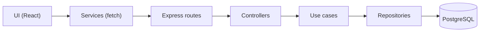

# SegFlow CRM

Sistema de gerenciamento de clientes e propostas/apolices de seguros para corretoras.

## Funcionalidades

- Cadastro de corretoras com usuario administrador
- Cadastro de clientes (Pessoa Fisica e Pessoa Juridica)
- Gerenciamento de propostas e apolices de seguros
- Gerenciamento de usuarios por corretora
- Painel com indicadores (dashboard)
- Busca, filtros e paginacao por cursor
- Consulta automatica de CEP (BrasilAPI)
- Autenticacao com JWT (access + refresh token com rotacao automatica)
- Interface responsiva com suporte a dark mode

---

## Tecnologias

### Frontend
- **React** + TypeScript + Vite
- **TailwindCSS** para estilizacao
- **CVA** (class-variance-authority) + clsx + tailwind-merge para variantes de componentes
- **React Router** para navegacao
- **Lucide React** para icones

### Backend
- **Node.js** + Express + compression
- **PostgreSQL** como banco de dados
- **JWT** para autenticacao (access + refresh tokens)
- **Zod** para validacao de dados
- **bcryptjs** para hash de senhas
- **JSDoc** para tipagem estatica (checkJS)

### Testes
- **Vitest** para backend e frontend
- **Testing Library** para componentes React
- **vitest-axe** para testes de acessibilidade

---

## Arquitetura (visao geral)



### Camadas
- UI/Transport: `routes`, `middleware`, `app`.
- Application: `controllers`, `useCases`, `dto`, `errors`.
- Domain: `entities`.
- Infrastructure: `repositories`, `db`.

---

## Estrutura do Projeto

```
segflow-crm/
├── .agents/               # Skills para assistentes AI (veja seção abaixo)
├── src/                    # Frontend React
│   ├── contexts/          # Context API (Auth)
│   ├── features/          # Features (pages/components)
│   ├── services/          # Services (API, storage)
│   ├── shared/            # Shared UI components (CVA, ErrorBoundary)
│   ├── types.ts           # TypeScript types
│   └── utils/             # Utils (formatters, cn, mensagens)
│
├── server/                # Backend Node.js
│   ├── config/           # DB config
│   ├── middleware/       # Middlewares (auth, validate)
│   ├── routes/           # Route definitions
│   ├── schemas/          # Zod schemas
│   ├── scripts/          # Database scripts
│   ├── src/              # Application/Domain/Infrastructure
│   │   ├── app.js
│   │   ├── config/
│   │   ├── application/  # controllers, useCases, dto, errors (AppError)
│   │   ├── domain/
│   │   └── infrastructure/ # repositories (incluindo refreshToken)
│   └── index.js           # Bootstrap do servidor
│
```

Mensagens de interface ficam centralizadas em `src/utils/*Messages.ts`. O `uiMessages` agrega
`uiBaseMessages`, `uiNavigationMessages` e `uiPageMessages` para organizar as copys por dominio.

---

## Como Rodar Localmente

### Pre-requisitos
- Node.js 18+
- PostgreSQL 14+

### 1. Clonar o repositorio
```bash
git clone git@github.com:maxjuniorbr/segflow-crm.git
cd segflow-crm
```

### 2. Configurar e rodar o Backend

```bash
cd server
npm install
cp .env.example .env
```

O arquivo `.env.example` ja vem com valores funcionais para desenvolvimento local. Edite apenas se precisar alterar porta, credenciais do banco ou segredo JWT.

> Variaveis disponiveis no `.env`: `PORT`, `NODE_ENV`, `DATABASE_URL`, `JWT_SECRET`, `RESET_DB_ON_STARTUP`, `CORS_ALLOWED_ORIGINS`.

Rodar o servidor:
```bash
npm run dev
```

Na primeira execucao (ou sempre que `RESET_DB_ON_STARTUP=true`), o banco sera criado e populado automaticamente com dados de teste. Para desativar esse comportamento, altere para `RESET_DB_ON_STARTUP=false` no `.env`.

### 3. Configurar e rodar o Frontend

Em outro terminal, na raiz do projeto:
```bash
npm install
npm run dev
```

Acessar: `http://localhost:5173`

---

## Scripts Disponiveis

### Frontend (raiz do projeto)
| Script | Descricao |
|---|---|
| `npm run dev` | Servidor de desenvolvimento |
| `npm run build` | Build de producao |
| `npm run preview` | Preview do build local |
| `npm run test` | Testes (Vitest + Testing Library + vitest-axe) |

### Backend (pasta `server/`)
| Script | Descricao |
|---|---|
| `npm run dev` | Servidor de desenvolvimento (reset/seed automatico se `RESET_DB_ON_STARTUP=true`) |
| `npm run test` | Testes unitarios, controllers, funcionais e de seguranca |
| `node scripts/dropDbLocal.js` | Limpar banco local |
| `node scripts/initDbLocal.js` | Criar tabelas |
| `node scripts/seedDbLocal.js` | Popular com dados de teste |

### Organizacao dos testes (backend)

| Diretorio | O que cobre |
|---|---|
| `tests/controllers/` | Testes unitarios por controller |
| `tests/unit/` | Entidades, use cases, repositorios |
| `tests/functional/` | Fluxos de integracao (auth, person type) |
| `tests/security/` | SQL injection, tenant isolation |

---

## Banco de Dados (Dev)

O banco local e descartavel. Com `RESET_DB_ON_STARTUP=true` (padrao), o backend recria as tabelas e popula dados de teste toda vez que inicia, via `server/scripts/devBootstrap.js`.

Nao existem migrations incrementais. O schema e definido em `server/scripts/schemaDefinition.js`.

Para controle manual, desative `RESET_DB_ON_STARTUP` e use os scripts individuais (`dropDbLocal`, `initDbLocal`, `seedDbLocal`).

---

## Endpoints da API (Resumo)

### Health Check
```
GET    /api/health             - Status do servidor e conexao com DB
```

### Autenticacao
```
POST   /api/register-broker    - Cadastrar corretora + usuario admin
POST   /api/login              - Login
GET    /api/auth/validate      - Validar token
POST   /api/auth/refresh       - Renovar access token via refresh token
POST   /api/auth/logout        - Encerrar sessao
```
> Autenticacao usa cookies httpOnly (access token + refresh token com rotacao). Para chamadas manuais, tambem aceita `Authorization: Bearer <token>`.

### Clientes (requer autenticacao)
```
GET    /api/clients            - Listar todos
GET    /api/clients/:id        - Buscar por ID
POST   /api/clients            - Criar novo
PUT    /api/clients/:id        - Atualizar
DELETE /api/clients/:id        - Deletar
```
> Listagem suporta `search`, `personType`, `limit`, `offset` (legacy) e `cursor` (paginacao por cursor) e retorna `{ items, total, limit, offset, nextCursor }`.

### Documentos (requer autenticacao)
```
GET    /api/documents          - Listar todos
GET    /api/documents/:id      - Buscar por ID
POST   /api/documents          - Criar novo
PUT    /api/documents/:id      - Atualizar
DELETE /api/documents/:id      - Deletar
```
> Listagem suporta `search`, `status`, `clientId`, `limit`, `offset` (legacy) e `cursor` (paginacao por cursor) e retorna `{ items, total, limit, offset, nextCursor }`.

### Corretoras (requer autenticacao)
```
GET    /api/brokers            - Listar
GET    /api/brokers/:id        - Buscar por ID
POST   /api/brokers            - Criar
PUT    /api/brokers/:id        - Atualizar
DELETE /api/brokers/:id        - Deletar
```

### Usuarios (requer autenticacao)
```
GET    /api/users              - Listar
GET    /api/users/:id          - Buscar por ID
PUT    /api/users/:id          - Atualizar
PUT    /api/users/:id/password - Alterar senha
DELETE /api/users/:id          - Deletar
```

### Dashboard (requer autenticacao)
```
GET    /api/dashboard/stats    - Indicadores do painel
```

---

## Tratamento de Erros

Backend: `server/src/application/errors` usa hierarquia de `AppError` (`NotFoundError`, `UnauthorizedError`, `ConflictError`, etc.) com handler centralizado.
Frontend: `src/services/api.ts` padroniza mensagens via `ApiError` e `ErrorBoundary` captura erros nao tratados.

---

## Validacoes e Tipagem

Backend: schemas Zod em `server/schemas` sao aplicados via middleware `validate`.
Frontend: formularios validam campos criticos (CPF/CNPJ/email) e usam tipos em `src/types.ts`.
Backend JS usa JSDoc + `checkJs` para tipagem estatica.

---

## Variaveis de Ambiente

Todas as variaveis ficam no arquivo `server/.env` (copiado de `.env.example`).

| Variavel | Descricao | Obrigatoria |
|---|---|---|
| `PORT` | Porta do servidor backend | Nao (padrao: `3001`) |
| `NODE_ENV` | Ambiente (`development`, `production`, `test`) | Nao |
| `DATABASE_URL` | URL de conexao PostgreSQL | Sim |
| `JWT_SECRET` | Chave secreta para tokens JWT | Sim |
| `RESET_DB_ON_STARTUP` | Recria banco ao iniciar (`true`/`false`) | Nao (padrao: `true`) |
| `CORS_ALLOWED_ORIGINS` | Origens permitidas, separadas por virgula | Nao |
| `VITE_API_URL` | URL do backend (usado pelo Vite no frontend) | Nao |

---

## Agent Skills (`.agents/skills/`)

Skills para assistentes AI (Cursor) usados no desenvolvimento do projeto. Cada skill fica em `.agents/skills/<nome>/SKILL.md`.

| Skill | Descricao |
|---|---|
| `auth-implementation-patterns` | Padroes de autenticacao (JWT, OAuth2, RBAC) |
| `code-review-excellence` | Boas praticas de code review |
| `error-handling-patterns` | Tratamento de erros, Result types, degradacao graciosa |
| `frontend-design` | Interfaces frontend com alto padrao visual |
| `javascript-testing-patterns` | Testes com Jest/Vitest, Testing Library, mocking, TDD |
| `modern-javascript-patterns` | ES6+, async/await, destructuring, programacao funcional |
| `nodejs-backend-patterns` | Backend Node.js com Express, middleware, API design |
| `postgresql-table-design` | Design de schema PostgreSQL, tipos, indices, constraints |
| `responsive-design` | Layouts responsivos, container queries, fluid typography |
| `sql-optimization-patterns` | Otimizacao de queries, EXPLAIN, estrategias de indexacao |
| `systematic-debugging` | Debugging sistematico com rastreamento de causa raiz |
| `tailwind-design-system` | Design system com Tailwind CSS v4 e design tokens |
| `test-driven-development` | Fluxo TDD — escrever testes antes da implementacao |
| `typescript-advanced-types` | Tipos avancados: generics, conditional types, mapped types |
| `vercel-react-best-practices` | Otimizacao de performance React/Next.js (Vercel Engineering) |
| `verification-before-completion` | Verificar evidencias antes de declarar tarefa concluida |
| `web-design-guidelines` | Auditoria de UI para acessibilidade e UX |

## Cursor Rules

| Rule | Escopo | Descricao |
|---|---|---|
| `mcp-servers` | Global (always apply) | Prioriza MCP servers (GitHub) sobre CLIs para operacoes remotas |
