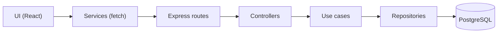

# SegFlow CRM

A management and multi-quote system for insurance brokerages — managing clients, proposals, and policies in a single platform, with an upcoming multi-quote engine via insurer APIs.

> **~90% of this code was written by AI.** I already had the repository and the idea, but time was always the bottleneck. With the [Cursor IDE](https://cursor.com), what seemed like weeks of work took just 2 days to build from zero to a production-ready system. This project was driven entirely by a *vibe coding* approach — where I guided the intent and the AI implemented it. See the [AI-Assisted Development (Vibe Coding)](#ai-assisted-development-vibe-coding) section for details.

---

## Features

- Brokerage registration with an administrator user
- Client registration (Individuals and Companies)
- Management of insurance proposals and policies
- User management per brokerage
- Dashboard with key metrics
- Search, filtering, and cursor-based pagination
- Automatic zip code (CEP) lookup (via BrasilAPI)
- JWT Authentication (access + refresh token with automatic rotation)
- Responsive interface with dark mode support

---

## Technologies

### Frontend
- **React 19** + TypeScript + Vite
- **TailwindCSS v4** for styling
- **CVA** (class-variance-authority) + clsx + tailwind-merge for component variants
- **React Router** for navigation
- **Lucide React** for icons

### Backend
- **Node.js** + Express + compression
- **PostgreSQL** as the database
- **JWT** for authentication (access + refresh tokens)
- **Zod** for data validation
- **bcryptjs** for password hashing
- **JSDoc** for static typing (checkJS — no migration to TypeScript)

### Testing
- **Vitest** for backend and frontend
- **Testing Library** for React components
- **vitest-axe** for accessibility testing

### Quality and CI
- **SonarCloud** for continuous static analysis (security, bugs, code smells)
- **Dependabot** for automatic dependency updates
- **k6** for load testing (`stress-test.js`)

---

## AI-Assisted Development (Vibe Coding)

This project was built as a proof of concept to evaluate the impact of AI assistants on software development. Over just 2 days, the entire implementation was driven by *vibe coding* within the [Cursor IDE](https://cursor.com) — defining the intent in natural language, while the AI produced the code.

### LLMs Used

Models were rotated based on the complexity of each task:

| Model | Provider | Main use case |
|---|---|---|
| **Claude Opus** | Anthropic | Architecture, complex refactoring, design decisions |
| **Claude Sonnet** | Anthropic | General implementation, features, bug fixes |
| **Codex** | OpenAI | Code generation, autocomplete |
| **Gemini** | Google | Code review, analyzing alternatives |

### Agent Instructions — Cursor and Claude Code

This repository keeps agent instructions compatible with both Cursor and Claude Code.

**Project instructions** are defined in `.agent/rules/workflow-instructions.md`. They act as the project manual for the agent: code in English, UI in pt-BR, Clean Architecture in the backend, and the design system and UX patterns to preserve.

**Skills** are maintained in `.agent/skills/` and referenced from the project instructions when relevant. They are specialized knowledge bases the agent queries on demand. The skills in this project were based on and adapted from the open ecosystem [skills.sh](https://skills.sh) (Vercel Labs), with technical reviews for the SegFlow context.

<details>
<summary><strong>Installed Skills (17)</strong></summary>

| Skill | Source | Description |
|---|---|---|
| `auth-implementation-patterns` | [wshobson/agents](https://skills.sh) | Authentication patterns (JWT, OAuth2, RBAC) |
| `code-review-excellence` | [wshobson/agents](https://skills.sh) | Code review best practices |
| `error-handling-patterns` | [wshobson/agents](https://skills.sh) | Error handling, Result types, graceful degradation |
| `frontend-design` | [anthropics/skills](https://skills.sh) | High-standard visual frontend interfaces |
| `javascript-testing-patterns` | [wshobson/agents](https://skills.sh) | Testing with Vitest, Testing Library, mocking, TDD |
| `modern-javascript-patterns` | [wshobson/agents](https://skills.sh) | ES6+, async/await, destructuring, functional programming |
| `nodejs-backend-patterns` | [wshobson/agents](https://skills.sh) | Node.js backend with Express, Clean Architecture |
| `postgresql-table-design` | [wshobson/agents](https://skills.sh) | PostgreSQL schema design, types, indexes, constraints |
| `responsive-design` | [wshobson/agents](https://skills.sh) | Responsive layouts, container queries, fluid typography |
| `sql-optimization-patterns` | [wshobson/agents](https://skills.sh) | Query optimization, EXPLAIN, indexing strategies |
| `systematic-debugging` | [obra/superpowers](https://skills.sh) | Systematic debugging with root cause tracking |
| `tailwind-design-system` | [wshobson/agents](https://skills.sh) | Design system with Tailwind CSS v4 and design tokens |
| `test-driven-development` | [obra/superpowers](https://skills.sh) | TDD workflow — writing tests before implementation |
| `typescript-advanced-types` | [wshobson/agents](https://skills.sh) | Advanced types: generics, conditional types, mapped types |
| `vercel-react-best-practices` | [vercel-labs/agent-skills](https://skills.sh) | React performance optimization (Vercel Engineering) |
| `verification-before-completion` | [obra/superpowers](https://skills.sh) | Verifying evidence before declaring a task complete |
| `web-design-guidelines` | [vercel-labs/agent-skills](https://skills.sh) | UI audit for accessibility and UX |

</details>

<details>
<summary><strong>Configured Rules (3)</strong></summary>

| Rule | Scope | Description |
|---|---|---|
| `segflow-crm-instructions` | Always apply | UI conventions, messages, architecture, security, and project patterns |
| `mcp-servers` | Always apply | Prioritizes MCP servers (GitHub) over CLIs for remote operations |
| `readme-consistency` | Glob-based | Keeps this README synced when structural files change |

</details>

### Jules (Google)

[Jules](https://jules.google.com) is a code agent by Google that works as a complementary reviewer. It analyzes the repository, suggests fixes, and can automatically generate patches.

Integration is done via REST API (`https://jules.googleapis.com/v1alpha`):
- **`GET /sessions`** — lists tasks/reviews created by Jules
- **`GET /sessions/{id}`** — details a session with the suggested patch
- **`GET /sources`** — connected repositories

To enable API queries from Cursor: create `.env.local` in the root with `JULES_API_KEY=<your-key>` (obtained at [jules.google.com/settings](https://jules.google.com/settings)). This file is already in `.gitignore`.

**Setup script:** the file `jules-setup.sh` in the project root is the environment bootstrap used by Jules when running sessions. It installs PostgreSQL, creates the database, installs dependencies, initializes the schema, and runs the full test suite (backend + frontend). This script runs automatically inside Jules's sandboxed VM — it is not intended for local development. To configure it, go to [Repo config](https://jules.google.com/repos/github/maxjuniorbr/segflow-crm/config) on the Jules dashboard.

### SonarCloud

The project is integrated with [SonarCloud](https://sonarcloud.io) for continuous static analysis. Scans are triggered automatically on every push to GitHub (Automatic Analysis — no CI pipeline needed).

**What SonarCloud analyzes:** bugs, vulnerabilities, code smells, security hotspots, test coverage, code duplication, and technical debt.

**API Integration:** besides the web dashboard, the SonarCloud token (stored in `.env.local` as `SONAR_TOKEN`) allows querying and managing issues programmatically:
- List open issues, filter by severity/type
- Mark false positives and won't-fix with justification
- Monitor analysis status

This API integration was used in this project to triage ~80 false positives (UI labels detected as "hard-coded passwords") directly from the terminal, without accessing the web dashboard.

### Dependabot

GitHub Dependabot is active in the repository and generates automatic pull requests when it detects security updates or new versions in dependencies (`npm`). PRs follow the `chore(deps):` pattern and are reviewed before merging.

---

## Architecture



### Layers
- **UI/Transport:** `routes`, `middleware`, `app`.
- **Application:** `controllers`, `useCases`, `dto`, `errors`.
- **Domain:** `entities`.
- **Infrastructure:** `repositories`, `db`.

---

## Project Structure

```
segflow-crm/
├── .agent/
│   ├── rules/             # Agent rules (conventions, patterns)
│   └── skills/            # AI skills (17 knowledge bases)
├── src/                    # Frontend React
│   ├── contexts/          # Context API (Auth, Toast)
│   ├── features/          # Features (pages/components by domain)
│   ├── services/          # Services (API, storage, toastBus)
│   ├── shared/
│   │   ├── components/    # Shared components (CVA, ErrorBoundary)
│   │   └── hooks/         # Reusable hooks (useModalBehavior)
│   ├── types.ts           # TypeScript types
│   └── utils/             # Formatters, validators, centralized messages
│
├── server/                # Node.js Backend
│   ├── config/           # DB config
│   ├── middleware/       # Middlewares (auth, validate)
│   ├── routes/           # Route definitions
│   ├── schemas/          # Zod schemas
│   ├── scripts/          # Database scripts (bootstrap, seed, drop)
│   ├── src/
│   │   ├── application/  # controllers, useCases, dto, errors, utils
│   │   ├── domain/       # entities
│   │   └── infrastructure/ # repositories (+ shared queryHelpers)
│   └── tests/            # Tests (controllers, unit, functional, security)
│       └── utils/         # Factories, centralized mocks (__mocks__), helpers
│
├── stress-test.js         # Load testing (k6)
└── .env.local             # Local keys (Jules, SonarCloud) — untracked
```

UI messages are centralized in `src/utils/*Messages.ts`. `uiMessages` aggregates `uiBaseMessages`, `uiNavigationMessages`, and `uiPageMessages` by domain.

---

## How to Run Locally

### Prerequisites
- Node.js 18+
- PostgreSQL 14+

### 1. Clone the repository
```bash
git clone git@github.com:maxjuniorbr/segflow-crm.git
cd segflow-crm
```

### 2. Configure the Backend

```bash
cd server
npm install
cp .env.example .env
```

The `.env.example` file comes with functional values for local development. Only edit it if you need to change the port, database credentials, or JWT secret.

On the first run (or whenever `RESET_DB_ON_STARTUP=true`), the database will be created and populated automatically with test data.

### 3. Run the application (Frontend + Backend)

```bash
cd ..
npm install
npm run dev
```

Access: `http://localhost:5173`

---

## Available Scripts

### Frontend (project root)
| Script | Description |
|---|---|
| `npm run dev` | Development server (frontend + backend) |
| `npm run build` | Production build |
| `npm run preview` | Local build preview |
| `npm run test` | Tests (Vitest + Testing Library + vitest-axe) |

### Backend (`server/` folder)
| Script | Description |
|---|---|
| `npm run dev` | Backend server (auto reset/seed if `RESET_DB_ON_STARTUP=true`) |
| `npm run test` | Unit, controller, functional, and security tests |
| `node scripts/dropDbLocal.js` | Drop local database |
| `node scripts/initDbLocal.js` | Create tables |
| `node scripts/seedDbLocal.js` | Populate with test data |

### Test Organization (backend)

| Directory | What it covers |
|---|---|
| `tests/controllers/` | Unit tests per controller |
| `tests/unit/` | Entities, use cases, repositories |
| `tests/functional/` | Integration flows (auth, person type) |
| `tests/security/` | SQL injection, tenant isolation |

---

## Database (Dev)

The local database is disposable. With `RESET_DB_ON_STARTUP=true` (default), the backend recreates the tables and seeds test data every time it starts, via `server/scripts/devBootstrap.js`.

There are no incremental migrations. The schema is defined in `server/scripts/schemaDefinition.js`.

For manual control, disable `RESET_DB_ON_STARTUP` and use the individual scripts.

---

## API Endpoints

### Health Check
```
GET    /api/health             - Server status and DB connection
```

### Authentication
```
POST   /api/register-broker    - Register brokerage + admin user
POST   /api/login              - Login
GET    /api/auth/validate      - Validate token
POST   /api/auth/refresh       - Renew access token via refresh token
POST   /api/auth/logout        - End session
```
> Authentication uses httpOnly cookies (access token + refresh token with rotation). For manual calls, it also accepts `Authorization: Bearer <token>`.

### Clients (requires authentication)
```
GET    /api/clients            - List (search, personType, limit, offset, cursor)
GET    /api/clients/:id        - Get by ID
POST   /api/clients            - Create new
PUT    /api/clients/:id        - Update
DELETE /api/clients/:id        - Delete
```

### Documents (requires authentication)
```
GET    /api/documents          - List (search, status, clientId, limit, offset, cursor)
GET    /api/documents/:id      - Get by ID
POST   /api/documents          - Create new
PUT    /api/documents/:id      - Update
DELETE /api/documents/:id      - Delete
```

### Brokerages (requires authentication)
```
GET    /api/brokers            - List
GET    /api/brokers/:id        - Get by ID
POST   /api/brokers            - Create
PUT    /api/brokers/:id        - Update
DELETE /api/brokers/:id        - Delete
```

### Users (requires authentication)
```
GET    /api/users              - List
GET    /api/users/:id          - Get by ID
PUT    /api/users/:id          - Update
PUT    /api/users/:id/password - Change password
DELETE /api/users/:id          - Delete
```

### Dashboard (requires authentication)
```
GET    /api/dashboard/stats    - Dashboard metrics
```

---

## Error Handling

**Backend:** hierarchy of `AppError` in `server/src/application/errors` (`NotFoundError`, `UnauthorizedError`, `ConflictError`, `ValidationError`) with a centralized handler that converts them into standardized HTTP responses.

**Frontend:** `ApiError` in `src/services/api.ts` standardizes error messages. `ErrorBoundary` catches unhandled errors. Toast for action feedback, inline Alert for form errors.

---

## Validations and Typing

**Backend:** Zod schemas in `server/schemas` applied via `validate` middleware. Business errors via `AppError` subclasses.

**Frontend:** forms validate critical fields (CPF/CNPJ/email with custom algorithms) and use types from `src/types.ts`. Password validation uses individual tests per character class (no ReDoS-vulnerable regex).

**JS Backend** uses JSDoc + `checkJs` for static typing without migrating to TypeScript.

---

## Environment Variables

### Backend (`server/.env`, copied from `.env.example`)

| Variable | Description | Required |
|---|---|---|
| `PORT` | Backend server port | No (default: `3001`) |
| `NODE_ENV` | Environment (`development`, `production`, `test`) | No |
| `DATABASE_URL` | PostgreSQL connection URL | Yes |
| `JWT_SECRET` | Secret key for JWT tokens | Yes |
| `RESET_DB_ON_STARTUP` | Recreate DB on start (`true`/`false`) | No (default: `true`) |
| `CORS_ALLOWED_ORIGINS` | Allowed origins, comma-separated | No |
| `VITE_API_URL` | Backend URL (used by Vite in frontend) | No |

### Local keys (`.env.local` in the root — untracked)

| Variable | Description |
|---|---|
| `JULES_API_KEY` | Jules API key (Google) |
| `SONAR_TOKEN` | SonarCloud token for API queries |

---

## Security

- All inputs are validated and sanitized (Zod + custom validators)
- Protection against SQL Injection (parameterized queries), IDOR, Mass Assignment, and Broken Access Control
- Passwords hashed with bcrypt; secrets exclusively in environment variables
- Rate limiting and CORS configured
- ReDoS-free validation regex (no lookaheads with nested quantifiers)
- Development logs sanitize user-controlled data against log injection
