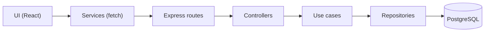

# SegFlow CRM

Sistema completo para corretoras de seguros — gerenciamento de clientes, propostas e apólices em uma plataforma única.

> **~90% deste código foi escrito por IA.** Este projeto é resultado de um teste corporativo de 30 dias com a ferramenta [Cursor](https://cursor.com), utilizando a abordagem de *vibe coding* — onde o desenvolvedor guia a intenção e a IA implementa. Veja a seção [Desenvolvimento Assistido por IA](#desenvolvimento-assistido-por-ia-vibe-coding) para detalhes.

---

## Funcionalidades

- Cadastro de corretoras com usuário administrador
- Cadastro de clientes (Pessoa Física e Pessoa Jurídica)
- Gerenciamento de propostas e apólices de seguros
- Gerenciamento de usuários por corretora
- Painel com indicadores (dashboard)
- Busca, filtros e paginação por cursor
- Consulta automática de CEP (BrasilAPI)
- Autenticação com JWT (access + refresh token com rotação automática)
- Interface responsiva com suporte a dark mode

---

## Tecnologias

### Frontend
- **React 19** + TypeScript + Vite
- **TailwindCSS v4** para estilização
- **CVA** (class-variance-authority) + clsx + tailwind-merge para variantes de componentes
- **React Router** para navegação
- **Lucide React** para ícones

### Backend
- **Node.js** + Express + compression
- **PostgreSQL** como banco de dados
- **JWT** para autenticação (access + refresh tokens)
- **Zod** para validação de dados
- **bcryptjs** para hash de senhas
- **JSDoc** para tipagem estática (checkJS — sem migração para TypeScript)

### Testes
- **Vitest** para backend e frontend
- **Testing Library** para componentes React
- **vitest-axe** para testes de acessibilidade

### Qualidade e CI
- **SonarCloud** para análise estática contínua (segurança, bugs, code smells)
- **Dependabot** para atualização automática de dependências
- **k6** para testes de carga (`stress-test.js`)

---

## Desenvolvimento Assistido por IA (Vibe Coding)

Este projeto foi construído como prova de conceito para avaliar o impacto de assistentes de IA no desenvolvimento de software. Durante 30 dias, toda a implementação foi conduzida via *vibe coding* no [Cursor IDE](https://cursor.com) — o desenvolvedor define a intenção em linguagem natural e a IA produz o código.

### LLMs Utilizadas

Os modelos foram alternados conforme a complexidade de cada tarefa:

| Modelo | Fornecedor | Uso principal |
|---|---|---|
| **Claude Opus** | Anthropic | Arquitetura, refatorações complexas, decisões de design |
| **Claude Sonnet** | Anthropic | Implementação geral, features, correções |
| **Codex** | OpenAI | Geração de código, autocomplete |
| **Gemini** | Google | Code review, análise de alternativas |

### Cursor IDE — Rules e Skills

O Cursor permite configurar **regras** e **skills** que guiam o comportamento dos agentes AI durante o desenvolvimento.

**Rules** (`.cursor/rules/`) são instruções permanentes que o agente segue em toda interação — equivalem a um "manual do projeto" para a IA. Por exemplo, a rule principal define que o código deve ser em inglês, a interface em pt-BR, que o backend segue Clean Architecture, e quais padrões de UI devem ser seguidos.

**Skills** (`.cursor/skills/`) são bases de conhecimento especializadas que o agente consulta sob demanda. Cada skill é um arquivo Markdown com diretrizes, padrões e exemplos de uma disciplina específica. Os skills deste projeto foram baseados e adaptados a partir do ecossistema aberto [skills.sh](https://skills.sh) (Vercel Labs), com revisão técnica para o contexto do SegFlow.

<details>
<summary><strong>Skills instalados (17)</strong></summary>

| Skill | Origem | Descrição |
|---|---|---|
| `auth-implementation-patterns` | [wshobson/agents](https://skills.sh) | Padrões de autenticação (JWT, OAuth2, RBAC) |
| `code-review-excellence` | [wshobson/agents](https://skills.sh) | Boas práticas de code review |
| `error-handling-patterns` | [wshobson/agents](https://skills.sh) | Tratamento de erros, Result types, degradação graciosa |
| `frontend-design` | [anthropics/skills](https://skills.sh) | Interfaces frontend com alto padrão visual |
| `javascript-testing-patterns` | [wshobson/agents](https://skills.sh) | Testes com Vitest, Testing Library, mocking, TDD |
| `modern-javascript-patterns` | [wshobson/agents](https://skills.sh) | ES6+, async/await, destructuring, programação funcional |
| `nodejs-backend-patterns` | [wshobson/agents](https://skills.sh) | Backend Node.js com Express, Clean Architecture |
| `postgresql-table-design` | [wshobson/agents](https://skills.sh) | Design de schema PostgreSQL, tipos, índices, constraints |
| `responsive-design` | [wshobson/agents](https://skills.sh) | Layouts responsivos, container queries, fluid typography |
| `sql-optimization-patterns` | [wshobson/agents](https://skills.sh) | Otimização de queries, EXPLAIN, estratégias de indexação |
| `systematic-debugging` | [obra/superpowers](https://skills.sh) | Debugging sistemático com rastreamento de causa raiz |
| `tailwind-design-system` | [wshobson/agents](https://skills.sh) | Design system com Tailwind CSS v4 e design tokens |
| `test-driven-development` | [obra/superpowers](https://skills.sh) | Fluxo TDD — escrever testes antes da implementação |
| `typescript-advanced-types` | [wshobson/agents](https://skills.sh) | Tipos avançados: generics, conditional types, mapped types |
| `vercel-react-best-practices` | [vercel-labs/agent-skills](https://skills.sh) | Otimização de performance React (Vercel Engineering) |
| `verification-before-completion` | [obra/superpowers](https://skills.sh) | Verificar evidências antes de declarar tarefa concluída |
| `web-design-guidelines` | [vercel-labs/agent-skills](https://skills.sh) | Auditoria de UI para acessibilidade e UX |

</details>

<details>
<summary><strong>Rules configuradas (3)</strong></summary>

| Rule | Escopo | Descrição |
|---|---|---|
| `segflow-crm-instructions` | Always apply | Convenções de UI, mensagens, arquitetura, segurança e padrões do projeto |
| `mcp-servers` | Always apply | Prioriza MCP servers (GitHub) sobre CLIs para operações remotas |
| `readme-consistency` | Glob-based | Mantém este README sincronizado quando arquivos estruturais mudam |

</details>

### Jules (Google)

O [Jules](https://jules.google.com) é um agente de código da Google que funciona como revisor complementar. Ele analisa o repositório, sugere correções e pode gerar patches automaticamente.

A integração é feita via API REST (`https://jules.googleapis.com/v1alpha`):
- **`GET /sessions`** — lista tarefas/reviews criadas pelo Jules
- **`GET /sessions/{id}`** — detalha uma sessão com o patch sugerido
- **`GET /sources`** — repositórios conectados

Para habilitar: crie `.env.local` na raiz com `JULES_API_KEY=<sua-chave>` (obtida em [jules.google.com/settings](https://jules.google.com/settings)). O arquivo já está no `.gitignore`.

### SonarCloud

O projeto está integrado ao [SonarCloud](https://sonarcloud.io) para análise estática contínua. O scan é acionado automaticamente a cada push no GitHub (Automatic Analysis — sem necessidade de CI pipeline).

**O que o SonarCloud analisa:** bugs, vulnerabilidades, code smells, security hotspots, cobertura de testes, duplicação de código e dívida técnica.

**Integração via API:** além do painel web, o token do SonarCloud (armazenado em `.env.local` como `SONAR_TOKEN`) permite consultar e gerenciar issues programaticamente:
- Listar issues abertas, filtrar por severidade/tipo
- Marcar falso-positivos e won't-fix com justificativa
- Monitorar status de análises

Essa integração por API foi usada neste projeto para triar ~80 falso-positivos (labels de UI detectados como "hard-coded passwords") diretamente do terminal, sem acessar o painel web.

### Dependabot

O GitHub Dependabot está ativo no repositório e gera pull requests automáticos quando detecta atualizações de segurança ou versões novas em dependências (`npm`). Os PRs seguem o padrão `chore(deps):` e são revisados antes do merge.

---

## Arquitetura



### Camadas
- **UI/Transport:** `routes`, `middleware`, `app`.
- **Application:** `controllers`, `useCases`, `dto`, `errors`.
- **Domain:** `entities`.
- **Infrastructure:** `repositories`, `db`.

---

## Estrutura do Projeto

```
segflow-crm/
├── .cursor/
│   ├── rules/             # Regras do agente (convenções, padrões)
│   └── skills/            # Skills AI (17 bases de conhecimento)
├── src/                    # Frontend React
│   ├── contexts/          # Context API (Auth, Toast)
│   ├── features/          # Features (pages/components por domínio)
│   ├── services/          # Services (API, storage, toastBus)
│   ├── shared/
│   │   ├── components/    # Componentes compartilhados (CVA, ErrorBoundary)
│   │   └── hooks/         # Hooks reutilizáveis (useModalBehavior)
│   ├── types.ts           # TypeScript types
│   └── utils/             # Formatters, validators, mensagens centralizadas
│
├── server/                # Backend Node.js
│   ├── config/           # DB config
│   ├── middleware/       # Middlewares (auth, validate)
│   ├── routes/           # Route definitions
│   ├── schemas/          # Zod schemas
│   ├── scripts/          # Database scripts (bootstrap, seed, drop)
│   ├── src/
│   │   ├── application/  # controllers, useCases, dto, errors, utils
│   │   ├── domain/       # entities
│   │   └── infrastructure/ # repositories (+ queryHelpers compartilhado)
│   └── tests/            # Testes (controllers, unit, functional, security)
│       └── utils/         # Factories, mocks centralizados (__mocks__), helpers
│
├── stress-test.js         # Testes de carga (k6)
└── .env.local             # Chaves locais (Jules, SonarCloud) — não versionado
```

Mensagens de interface ficam centralizadas em `src/utils/*Messages.ts`. O `uiMessages` agrega `uiBaseMessages`, `uiNavigationMessages` e `uiPageMessages` por domínio.

---

## Como Rodar Localmente

### Pré-requisitos
- Node.js 18+
- PostgreSQL 14+

### 1. Clonar o repositório
```bash
git clone git@github.com:maxjuniorbr/segflow-crm.git
cd segflow-crm
```

### 2. Configurar o Backend

```bash
cd server
npm install
cp .env.example .env
```

O arquivo `.env.example` vem com valores funcionais para desenvolvimento local. Edite apenas se precisar alterar porta, credenciais do banco ou segredo JWT.

Na primeira execução (ou sempre que `RESET_DB_ON_STARTUP=true`), o banco será criado e populado automaticamente com dados de teste.

### 3. Rodar a aplicação (Frontend + Backend)

```bash
cd ..
npm install
npm run dev
```

Acessar: `http://localhost:5173`

---

## Scripts Disponíveis

### Frontend (raiz do projeto)
| Script | Descrição |
|---|---|
| `npm run dev` | Servidor de desenvolvimento (frontend + backend) |
| `npm run build` | Build de produção |
| `npm run preview` | Preview do build local |
| `npm run test` | Testes (Vitest + Testing Library + vitest-axe) |

### Backend (pasta `server/`)
| Script | Descrição |
|---|---|
| `npm run dev` | Servidor backend (reset/seed automático se `RESET_DB_ON_STARTUP=true`) |
| `npm run test` | Testes unitários, controllers, funcionais e de segurança |
| `node scripts/dropDbLocal.js` | Limpar banco local |
| `node scripts/initDbLocal.js` | Criar tabelas |
| `node scripts/seedDbLocal.js` | Popular com dados de teste |

### Organização dos testes (backend)

| Diretório | O que cobre |
|---|---|
| `tests/controllers/` | Testes unitários por controller |
| `tests/unit/` | Entidades, use cases, repositórios |
| `tests/functional/` | Fluxos de integração (auth, person type) |
| `tests/security/` | SQL injection, tenant isolation |

---

## Banco de Dados (Dev)

O banco local é descartável. Com `RESET_DB_ON_STARTUP=true` (padrão), o backend recria as tabelas e popula dados de teste toda vez que inicia, via `server/scripts/devBootstrap.js`.

Não existem migrations incrementais. O schema é definido em `server/scripts/schemaDefinition.js`.

Para controle manual, desative `RESET_DB_ON_STARTUP` e use os scripts individuais.

---

## Endpoints da API

### Health Check
```
GET    /api/health             - Status do servidor e conexão com DB
```

### Autenticação
```
POST   /api/register-broker    - Cadastrar corretora + usuário admin
POST   /api/login              - Login
GET    /api/auth/validate      - Validar token
POST   /api/auth/refresh       - Renovar access token via refresh token
POST   /api/auth/logout        - Encerrar sessão
```
> Autenticação usa cookies httpOnly (access token + refresh token com rotação). Para chamadas manuais, também aceita `Authorization: Bearer <token>`.

### Clientes (requer autenticação)
```
GET    /api/clients            - Listar (search, personType, limit, offset, cursor)
GET    /api/clients/:id        - Buscar por ID
POST   /api/clients            - Criar novo
PUT    /api/clients/:id        - Atualizar
DELETE /api/clients/:id        - Deletar
```

### Documentos (requer autenticação)
```
GET    /api/documents          - Listar (search, status, clientId, limit, offset, cursor)
GET    /api/documents/:id      - Buscar por ID
POST   /api/documents          - Criar novo
PUT    /api/documents/:id      - Atualizar
DELETE /api/documents/:id      - Deletar
```

### Corretoras (requer autenticação)
```
GET    /api/brokers            - Listar
GET    /api/brokers/:id        - Buscar por ID
POST   /api/brokers            - Criar
PUT    /api/brokers/:id        - Atualizar
DELETE /api/brokers/:id        - Deletar
```

### Usuários (requer autenticação)
```
GET    /api/users              - Listar
GET    /api/users/:id          - Buscar por ID
PUT    /api/users/:id          - Atualizar
PUT    /api/users/:id/password - Alterar senha
DELETE /api/users/:id          - Deletar
```

### Dashboard (requer autenticação)
```
GET    /api/dashboard/stats    - Indicadores do painel
```

---

## Tratamento de Erros

**Backend:** hierarquia de `AppError` em `server/src/application/errors` (`NotFoundError`, `UnauthorizedError`, `ConflictError`, `ValidationError`) com handler centralizado que converte em respostas HTTP padronizadas.

**Frontend:** `ApiError` em `src/services/api.ts` padroniza mensagens de erro. `ErrorBoundary` captura erros não tratados. Toast para feedback de ações, Alert inline para erros de formulário.

---

## Validações e Tipagem

**Backend:** schemas Zod em `server/schemas` aplicados via middleware `validate`. Erros de negócio via subclasses de `AppError`.

**Frontend:** formulários validam campos críticos (CPF/CNPJ/email com algoritmos próprios) e usam tipos em `src/types.ts`. Validação de senha usa testes individuais por classe de caractere (sem regex vulnerável a ReDoS).

**Backend JS** usa JSDoc + `checkJs` para tipagem estática sem migrar para TypeScript.

---

## Variáveis de Ambiente

### Backend (`server/.env`, copiado de `.env.example`)

| Variável | Descrição | Obrigatória |
|---|---|---|
| `PORT` | Porta do servidor backend | Não (padrão: `3001`) |
| `NODE_ENV` | Ambiente (`development`, `production`, `test`) | Não |
| `DATABASE_URL` | URL de conexão PostgreSQL | Sim |
| `JWT_SECRET` | Chave secreta para tokens JWT | Sim |
| `RESET_DB_ON_STARTUP` | Recria banco ao iniciar (`true`/`false`) | Não (padrão: `true`) |
| `CORS_ALLOWED_ORIGINS` | Origens permitidas, separadas por vírgula | Não |
| `VITE_API_URL` | URL do backend (usado pelo Vite no frontend) | Não |

### Chaves locais (`.env.local` na raiz — não versionado)

| Variável | Descrição |
|---|---|
| `JULES_API_KEY` | Chave de API do Jules (Google) |
| `SONAR_TOKEN` | Token do SonarCloud para consultas via API |

---

## Segurança

- Todas as entradas validadas e sanitizadas (Zod + validators customizados)
- Proteção contra SQL Injection (queries parametrizadas), IDOR, Mass Assignment e Broken Access Control
- Senhas com hash bcrypt; segredos exclusivamente em variáveis de ambiente
- Rate limiting e CORS configurados
- Regex de validação livre de ReDoS (sem lookaheads com quantificadores aninhados)
- Log de desenvolvimento sanitiza dados user-controlled contra log injection
